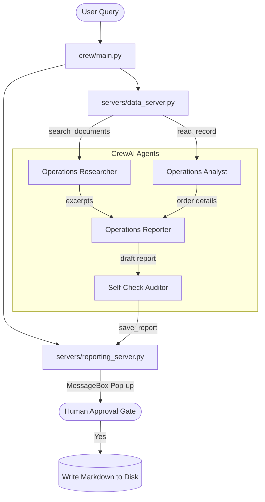

# Operations Assistant

A multi-agent crew built with **CrewAI** that connects to two local **Model Context Protocol (MCP)** servers over standard input/output (stdio) transports to retrieve policy documents, query spreadsheet order records, verify guidelines, and save formatted markdown reports with direct source citations.

---

## 1. System Architecture

The project implements a secure, defense-in-depth architecture:



- **Operations Data Server (`servers/data_server.py`)**: Exposes search tools (`search_documents`) and spreadsheet query tools (`read_record`) along with a resource list (`documents://list`).
- **Operations Reporting Server (`servers/reporting_server.py`)**: Exposes report saving tools (`save_report`). It has a **Human Approval Gate** that pops up a graphical MessageBox window on the screen for user approval before writing to disk, and a **Path Traversal Guardrail** that prevents writing outside of the target reports folder.
- **Verification Layer**: A fourth agent (`Self-Check Auditor`) checks the draft report against raw data to prevent hallucinations and intercept prompt injection payloads.

---

## 2. Directory Structure

```text
├── data/
│   ├── documents/                     # 10 Short synthetic document files
│   │   ├── policy_returns.txt
│   │   ├── policy_shipping.txt
│   │   └── ...
│   └── orders.csv                     # Spreadsheet order data (10 rows)
├── servers/
│   ├── data_server.py                 # MCP Data Server (read tools & list resource)
│   └── reporting_server.py            # MCP Reporting Server (save tool + human gate)
├── crew/
│   ├── agents.py                      # CrewAI agent definitions
│   ├── tasks.py                       # CrewAI task definitions
│   └── main.py                        # Launch script and adapter coordinator
├── tests/
│   ├── test_tools.py                  # Unit tests for MCP server tools
│   └── test_e2e.py                    # E2E test for the full crew
├── output/
│   └── reports/                       # Target reports directory
├── .env.example                       # Environment configuration template
├── pyproject.toml                     # Python dependency details (uv managed)
├── decision_log.md                    # Record of technical tradeoffs
├── reflection.md                      # Post-development reflections
└── ai_usage.md                        # AI-assisted engineering log
```

---

## 3. Installation and Setup

Everything is designed to run locally and for free using python `uv` package manager:

1. **Install uv** (if not already installed):
   ```powershell
   powershell -c "irm https://astral.sh/uv/install.ps1 | iex"
   ```
2. **Create the virtual environment**:
   ```bash
   uv venv --python 3.12
   ```
3. **Install dependencies**:
   ```bash
   uv pip install mcp crewai "crewai-tools[mcp]" python-dotenv pydantic pytest litellm
   ```
4. **Configure the environment**:
   - Copy `.env.example` to `.env`:
     ```bash
     copy .env.example .env
     ```
   - Open `.env` and set your `GROQ_API_KEY`:
     ```env
     GROQ_API_KEY=gsk_your_actual_groq_api_key_here
     ```

---

## 4. How to Run

### Interactive Assistant Run
To run the crew interactively and ask a custom question:
```bash
uv run python crew/main.py
```
*Note: A native Windows prompt will pop up asking for permission to save the file when the verifier attempts to save the finalized report!*

### Test with the MCP Inspector
You can debug and inspect the servers using the official MCP inspector client:
```bash
# Inspect the Data Server
npx -y @modelcontextprotocol/inspector uv run python servers/data_server.py

# Inspect the Reporting Server
npx -y @modelcontextprotocol/inspector uv run python servers/reporting_server.py
```

---

## 5. Running Tests

Unit tests mock the GUI popups, allowing automatic validation of validation checks and file actions:
```bash
# Run all unit and e2e tests
uv run pytest
```
